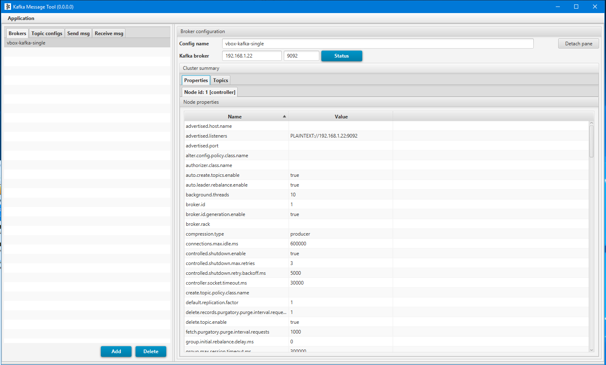
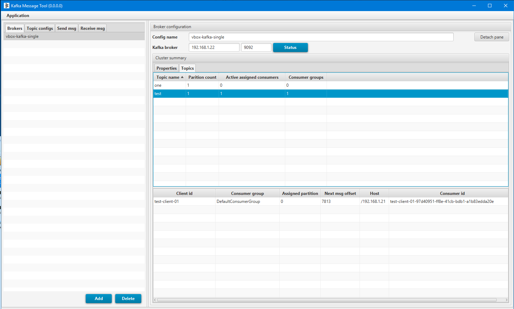
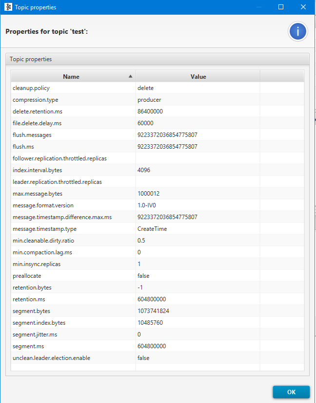
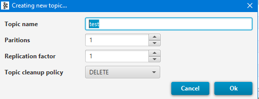
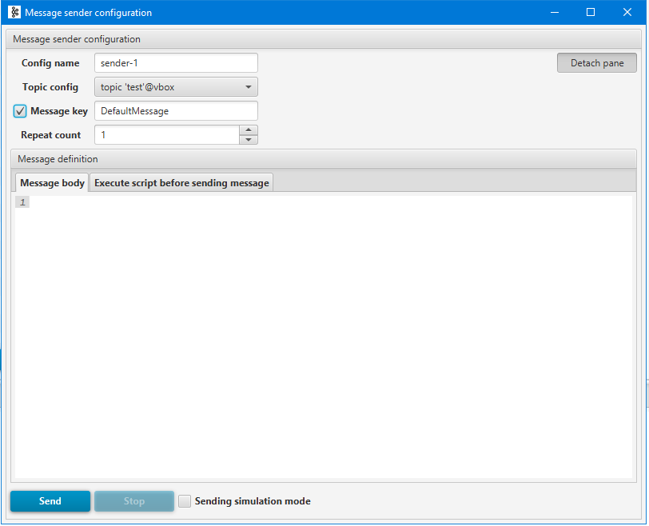
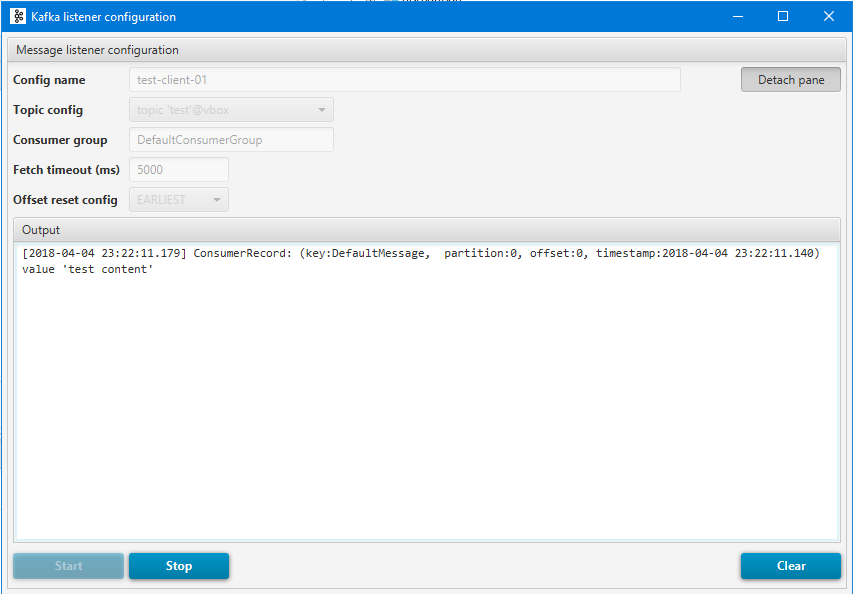

# Kafka Message Tool (KMT)
Simple GUI tool (javaFX) to facilitate sending/receiving messages to/from *Apache Kafka* broker

**Features**
 - Display kafka broker configuration for each node in cluster
 - Show partition assignments to currently connected consumers (in consumer group)
 - Send multi-messages to kafka with scripted content manner (with groovy scripting)
 - Send messages (ProducerRecord) with user provided key
 - Find which topic partition will be chosen by kafka broker to put the message into
 - Each send/receive window can be detached

**Example screenshots**
- 
- 
- 
- 
- 
- 

**Build**
- To build the app just execute `build` gradle task. There should be `kafka-message-tool<version>.jar` file created in
`<project_dir>/build/libs` directory

**Run**
 - To run the app just call`java -jar kafka-message-tool-<version>.jar`
 New file with saved settings will appear in the same location as applicaiton jar file. 

**Versioning**
- The versioning scheme is as follows:
  - `<AppVersion>-<MajorPatchVersion>-<MinorPatchVersion>-<FixVersion>` e.g [v.1.2.4.5]
- What 'major patch' or 'minor patch' mean ?
It is arbitrary and related to effort amount that was invested in implementing particular functionality.

**Credits**
 - Thanks to [RichtextFX](https://github.com/TomasMikula/RichTextFX) for providing cool CodeArea gui component
 - Message syntax highlighting patterns for JSON were taken from [JFXParser](https://github.com/notnotme/JFXParser)
 - Thanks to [this page](http://respostas.guj.com.br/47439-habilitar-copypaste-tableview-funcionando-duvida-editar-funcionalidade) for copy TableView cell content code
 - Thanks to [controlfx](http://fxexperience.com/controlsfx/) for textfield with autocomplection and other cool controls

**Why another Kafka Apache tool ?**  
This application is mainly designed for testers/developers who want to to quickly check/verify some kafka cluster properties 
(or send/receive few messages) without the need to use original console scripts provided with kafka after installation.
Functionality is much more limited than original scripts in favour of simpilicity and usability   
The goal of creating this tool were:
- No dependency to zookeeper 
  - User should not be forced to provide zookeeper ip and port to work with kafka.
  Only ip and port of kafka cluster should be enough.
- Application should be self sufficient - no additional 'servers' or backend should be required to use it.
- No installation should be required. It should work out of the box.  Just type `java -jar  <application.jar>`

- JavaFx issues
  

